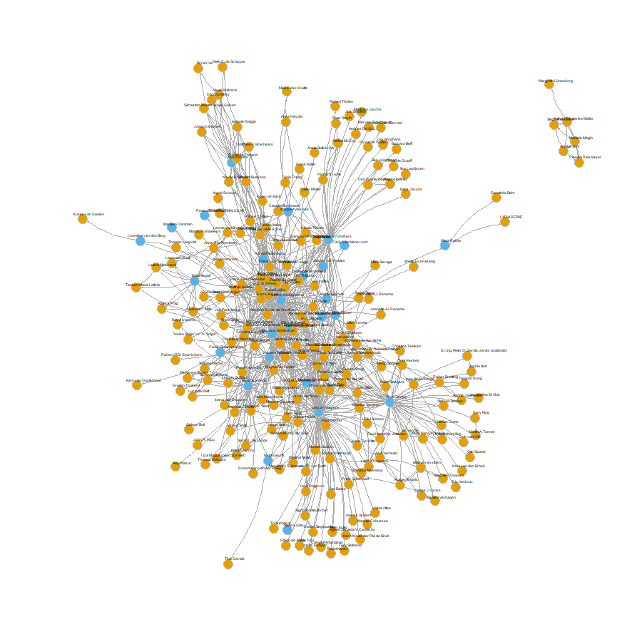

# Assignment before class: Revised introduction

## **few sentences for summary**

This study considers the continuing globalization with its subsequent
growing interconnectedness between scientists at different universities
and the reducing psychic distance to seek further understanding of the
relationship between geographical distance and the collaboration
networks of social scientists at Dutch universities. The study is
carried out in two-fold: firstly, the collaboration network between
Sociology departments at Dutch universities will be studied, secondly,
the within-department collaboration network of scientists within the
Sociology department at Radboud University will analysed. To do this, a
social network perspective will be applied to uncover the structure of
the collaboration networks.

## **Introduction – Geographical distance and co-authorship collaboration network analysis**

Over the last few centuries, globalization processes have resulted in
economic, political and cultural interdependence, supported by an
immense worldwide network of international connections and collaboration
(Gui et al., 2019). According to some, the globalization of science is
the most important aspect of modern globalization (Freeman, 2010). The
subsequent knowledge flows are beneficial for economic development and
specialization, networking, and the competitiveness in the scientific
field (Gui et al., 2019). Additionally, globalization has created a
large international collaboration network that benefits both students
and teachers when seeking specific knowledge and specializations
(Fitzgerald et al., 2021). While globalization is not able to shrink
geographical distances in a literal sense, our individual perception and
awareness of the distance between us and a secondary location, also
referred to as ‘psychic distance’, has decreased as a result of
globalization (Ojala, 2009). That is, communication methods, such as
phones, e-mail, and other telecommunication technologies have made it
much easier to reach out to others who are not directly in our immediate
vicinity (Hoekman et al., 2010). While this relation has been proven for
long-distance, international scientific collaboration (e.g. Hoekman et
al., 2010), little research has been done on the relationship between
geographical distance and scientific collaboration networks on a
singular country and organizational level. While it can be expected to
be less evident, geographical distance can still be expected to be a
relevant factor in scientific collaboration networks between actors
within a country. -elaborate on WHY- This study aims to do so by
studying geographical distance and co-authorship collaboration networks
in the Netherlands, resulting in the following research question: [RQ1a]
To what extent does the geographical distance between Sociology
departments at Dutch universities influence the between-university
collaboration network of scientists located at these universities? Broad
societal changes, such as the COVID-19 pandemic between 2020 and 2022
had possibly lasting consequences for scientific collaboration networks.
That is, government mandated measures such as working from home, limited
travelling and avoiding close contact to others, might have changed the
way these networks were constructed. This study will look at changing
spatial patterns of research collaboration by studying co-authorship
over time, resulting in the following questions: [RQ1b] To what extent
has the relation between geographical distance and between-university
collaboration networks of Dutch Sociology departments changed over time?
And: [RQ1c] What patterns can be discovered within the collaboration
network?

Moreover, this study will attempt to deepen our understanding of these
effects by looking at the relation between physical distance and
collaboration networks on an even smaller scale. At the organizational
level, a relation between psychic distance between two scientists and
collaboration activities might exist as well. Scientists who work within
close proximity might run into each other more often than those who work
at opposite ends of a building. Regular interaction on the work floor
can spark ideas and interest in collaboration (SOURCE). RQ2a: To what
extent does the geographical distance within the Sociology department at
Radboud University influence the within-department collaboration network
of scientists within this department? Similar to the previous set of
research questions, this study will also look into changes in
collaboration activities over time within a university department.
Studying these changes can provide insight into the extent to which
broader societal changes (e.g. a global pandemic) and
organizational-level developments (e.g. department relocation) influence
collaboration networks on a small spatial scale. For example, the
outbreak of the COVID-19 pandemic between 2020 and 2022 might have
resulted different collaboration activities within the department as
employees were forced to work from home, thereby possibly experiencing
greater psychic distance and missing out on the daily meeting
opportunities that can spark collaboration interests. At an
organizational level, the relocation of Radboud’s whole social science
department to a new building in 2021 might have resulted in a shift
within the previous collaboration structure. This results in the
following questions: [RQ2b] To what extent has the relation between
geographical distance and within-department collaboration network
changed over time? And [RQ2c] What patterns can be discovered within the
collaboration network?

## RQ's op een rijtje:

RQ1: descriptive To what extent does the geographical distance between
Sociology departments at Dutch universities influence the
between-university collaboration network of scientists located at these
universities?

-   To what extent has this changed over time?

-   What patterns can be discovered within the collaboration network?

RQ2: CASE STUDY: To what extent does the geographical distance within
the Sociology department at Radboud University (or Groningen University)
influence the within-department collaboration network of scientists
within this department?

-   To what extent has this changed over time?

-   What patterns can be discovered within the collaboration network?

## Which variables to webscrape:

-   all employees of Sociology departments in at Dutch Universities
    (+career age, title, number of publications, number of citations,
    gender via first name)

-   Coordinates/geo locations of Sociology departments --\> can you
    create a geographical map in R?
    [map](https://richardlent.github.io/rnotebooks/maps.nb.html)

1.  RU
2.  RUG
3.  Erasmus
4.  UU
5.  UVA
6.  VU
7.  Tilburg Universiteit
8.  Leiden/Den Haag

-   and/or time distance between each of the departments

    [Google maps API](https://serpapi.com/google-maps-api)\
    [Google maps API
    directions](https://serpapi.com/google-maps-directions-api)\
    [very
    cool](https://serpapi.com/playground?engine=google_maps_directions&start_addr=Thomas+Van+Aquinostraat+4+Nijmegen&end_addr=Wassenaarseweg+52+Leiden&gl=nl&hl=en&travel_mode=0&distance_unit=0)

## Bespreking

-   -\> instead of the Google Maps API, look into Leaflet and
    OpenStreetMap. Tutorial via Jochems pages about GIS
-   zijtak: buurtkenmerk treinstation in de buurt en reistijden tussen
    uni & station, van station tot station
-   zijtak: leuk mapje van NL met de universiteiten

---
---
---

# Assignments in class - Chapter 9

Network visualization

```{r}
#install.packages("sna")
#packages
library(sna)
library(lavaan)
library(RSiena)
library(igraph)
```


## Zachary’s karate club
```{r}

require(igraph)
g <- make_graph("Zachary")
plot(g)

gmat <- as_adjacency_matrix(g, type = "both", sparse = FALSE)
gmat


  #Descriptive statistics
# number of nodes
vcount(g)
# number of edges 
ecount(g)

#degree
igraph::degree(g)
# hist(table(degree(g)), xlab='indegree', main= 'Histogram of indegree')

#transitivity
# be aware that directed graphs are considered as undirected. but g is undirected.
igraph::transitivity(g, type = c("localundirected"), isolates = c("NaN", "zero"))

#betweenness
igraph::betweenness(g, directed = FALSE)

#which nodes grab your attention? 1 and 34, very high number so very central in the network.


--
#dyad census (=classifying each pair of vertices of a directed graph into three categories: mutual (there is at least one edge from a to b and also from b to a); asymmetric (there is at least one edge either from a to b or from b to a, but not the other way) and null (no edges between a and b in either direction))
#igraph::dyad.census(g)
#asym=0 means undirected

#tryad census
igraph::triad.census(g)
# I will use sna because it shows the names of the triads as well.
#install.packages("sna")
#library(sna)
#sna::triad.census(gmat)
#unloadNamespace("sna")  #I will detach this package again, otherwise it will interfere with all kind of functions from igraph, and my students will hate me for that.

#global transitivity= simply the ratio of the count of triangles and connected triples in the graph. In directed graphs, edge directions are ignored (in other words: the number of transitive triads divided by all possible transitive triads)
#Based on the above triad.census, please calculate the global transitivity of the network:
#three ways
igraph::transitivity(g, type = "global")
sna::gtrans(gmat)

triad_g <- data.frame(sna::triad.census(gmat))

transitivity_g <- (3 * triad_g$X300)/(triad_g$X201 + 3 * triad_g$X300)
transitivity_g
```

```{r}
#Making size proportional to betweenness score
# changing V
V(g)$size = betweenness(g, normalized = T, directed = FALSE) * 60 + 10  #after some trial and error
plot(g, mode = "undirected")

set.seed(2345)
l <- layout_with_mds(g)  #https://igraph.org/r/doc/layout_with_mds.html
plot(g, layout = l)


#let us take a look at the coordinates
l[1, 1] <- 4
l[34, 1] <- -3.5
plot(g, layout = l)

#CAUTION!!In the last step we manipulated our data. The coordinates of two nodes have been altered manually and are no longer determined by some ‘objective’ algorithm. Is this not the same as slightly changing an inconvenient correlation in a correlation matrix or as removing some outliers from our dataset? At the very minimum, make sure to tell your readers what you have done! Add a note/legend to your graph.
plot(g, layout = l, margin = c(0, 0, 0, 0))
legend(x = -2, y = -1.5, c("Note: the position of nodes 1 and 34 have been set by Jochem Tolsma \n for visualisation purposes only and do not reflect network properties"), bty = "n", cex = 0.8)


```
## Twitter
```{r}

load("twitter_20190919.RData")  #change to your working directory, done by putting file in github/ labjournal map
str(twitter_20190919, 1)
#Save the list elements in separate objects
keyf <- twitter_20190919[[1]]
mydata <- twitter_20190919[[2]]
seats <- twitter_20190919[[3]]

#fishing for data, dont understand yet
fnet <- mydata$depvars$fnet
atmnet <- mydata$depvars$atmnet
rtnet <- mydata$depvars$rtnet

vrouw <- mydata$cCovars$vrouw
partij <- mydata$cCovars$partij
ethminz <- mydata$cCovars$ethminz
lft <- mydata$cCovars$lft

# if you construct an object for RSiena, covariates are mean centered by default. I would like to
# have the original values again.
ethminz <- ethminz + attributes(ethminz)$mean
partij <- partij + attributes(partij)$mean
vrouw <- vrouw + attributes(vrouw)$mean
lft <- lft + attributes(lft)$mean

str(fnet)

fnet1 <- fnet[, , 1]  #friendship network wave 1
atmnet1 <- atmnet[, , 1]  #atmention network wave 1
# we will use wave 2 and 3 later.
atmnet2 <- atmnet[, , 2]
atmnet3 <- atmnet[, , 3]

#replacing missings with 0
# table(fnet1, useNA='always') #uncomment if you want
fnet1[fnet1 == 10] <- 0
# table(fnet1, useNA='always') #uncomment if you want

atmnet1[atmnet1 == 10] <- 0
atmnet2[atmnet2 == 10] <- 0
atmnet3[atmnet3 == 10] <- 0

```


### first plots
```{r}
#step 1: make a graph object
G1 <- igraph::graph_from_adjacency_matrix(atmnet1, mode = "directed", weighted = NULL, diag = TRUE, add.colnames = NA,
    add.rownames = NA)

# we need to retrieve the edges.
edges <- igraph::as_data_frame(G1, what = "edges")

# the first variable of the data we can attach needs to be some id, thus reorder columns of keyf
keyf <- cbind(keyf$EGOid, keyf[, names(keyf) != "EGOid"])
# the name has been changed as well. Lets correct this
names(keyf)[1] <- "EGOid"

# rebuild the graph.
G1 <- graph_from_data_frame(edges, directed = TRUE, vertices = keyf)

# let us examine the attributes
vertex_attr(G1)

# thus to find the names of our MPs we could now do this:
V(G1)$Naam


plot(G1)

#omg way too chaotic
G1 <- simplify(G1)
plot(G1)
#still very intense, how dense is this network??
edge_density(G1) #not very dense...


```
### plotting only reciprocated ties
```{r}
# define undirected network
atmnet1_un <- atmnet1 == 1 & t(atmnet1) == 1

G2 <- graph_from_adjacency_matrix(atmnet1_un, mode = "undirected", weighted = NULL, diag = TRUE, add.colnames = NA,
    add.rownames = NA)

# attach data if you want
edges <- igraph::as_data_frame(G2, what = "edges")
G2 <- graph_from_data_frame(edges, directed = FALSE, vertices = keyf)
plot(G2)

#make more simple
G2 <- simplify(G2)
plot(G2, mode = "undirected")


#selecting nodes to plot
# first make sure we don't end up with MPS who only mention themselves
diag(atmnet1_un) <- 0

# lets find the noisolates
noisolates <- rowSums(atmnet1_un, na.rm = T) > 0
# length(noisolates) sum(noisolates) if you select, select both correct nomination network as ego
# characteristics
atmnet1_un_sel <- atmnet1_un[noisolates, noisolates]
# if you are going to use the dataset keyf to add characteristics to the plot later, make sure to
# run the correct selection as well!!!
keyf_sel <- keyf[noisolates, ]

G2_sel <- graph_from_adjacency_matrix(atmnet1_un_sel, mode = "undirected", weighted = NULL, diag = TRUE,
    add.colnames = NA, add.rownames = NA)
G2_sel <- simplify(G2_sel)
plot(G2_sel, mode = "undirected")


#selecting on node attributes
# option 1: see above.  only select MPs from the liberal party
selection <- keyf$Partij == "VVD"
# build new adjacency matrix
atmnet1_un_sel2 <- atmnet1_un[selection, selection]
# etc.

# option 2. Suppose we have attached our dataset to our graph object.  only select MPs from the
# liberal party
selection <- V(G2)$Partij == "VVD"
selection_id <- which(selection)  # this gives us a numeric variable
G_sel <- induced_subgraph(G2, v = selection_id)
plot(G_sel)

```
### changing vertices
```{r}
#changing V (size)
V(G2)$size = igraph::degree(G2) * 1.05  #naturally, you may use a different node-level structural characteristic here. 
plot(G2, mode = "undirected")

#labels and color
V(G2)$label = as.character(V(G2)$Naam2)
V(G2)$label.cex = 1
V(G2)$color <- ifelse(V(G2)$Geslacht == "vrouw", "red", "green")
plot(G2, mode = "undirected")

```
### changing edges - arrow size and curvature
```{r}
# changing edges
E(G2)$arrow.size = 0.4
E(G2)$curved = 0.3
plot(G2, mode = "undirected")

#adding legend
# adding legend because I am working in Rmarkdown I need some {}
plot.igraph(G2, margin = 0, mode = "udirected")
legend(x = -1, y = -1, c("Female", "Male"), pch = 21, col = "#777777", pt.bg = c("red", "green"), pt.cex = 2,
    cex = 0.8, bty = "n", ncol = 1)

#adding pics/coordinates
#knitr::include_graphics("picture.jpeg")
plot(keyf$X, keyf$Y, xlim = c(-18, 18), ylim = c(-18, 18), col = keyf$Partij_col, pch = 16)

# it really depends on your plotting window (size, resolution etc.) to get consistent results you
# need to define this beforehand. won't do that now.


# give nodes coler of their party
V(G2)$color <- keyf$Partij_col

# change node size a bit
V(G2)$size = igraph::degree(G2) * 1.05 + 6

# remove the labels
V(G2)$label = ""

# less curvature
E(G2)$curved = 0.1

owncoords <- cbind(keyf$X, keyf$Y)
owncoords <- owncoords/8
owncoords[, 1] <- (owncoords[, 1] - mean(owncoords[, 1]))
owncoords[, 2] <- (owncoords[, 2] - mean(owncoords[, 2]))
plot.igraph(G2, mode = "undirected", layout = owncoords, rescale = F, margin = c(0, 0, 0, 0), xlim = c(min(owncoords[,
    1]), max(owncoords[, 1])), ylim = c(min(owncoords[, 2]), max(owncoords[, 2])))


#preparation
# construct adjacency matrix first define the recipricated atmentions in each wave
atmnet1_un <- atmnet1 == 1 & t(atmnet1) == 1
atmnet2_un <- atmnet2 == 1 & t(atmnet2) == 1
atmnet3_un <- atmnet3 == 1 & t(atmnet3) == 1

atmnet_weighted <- atmnet1_un + atmnet2_un + atmnet3_un

# contstruct graph / let us keep the loops note that the parameter 'weighted' is set to true.
G_w <- igraph::graph_from_adjacency_matrix(atmnet_weighted, mode = "undirected", weighted = TRUE, diag = TRUE,
    add.colnames = NA, add.rownames = NA)

# attach data
edges <- igraph::as_data_frame(G_w, what = "edges")
# inspect the weight.
edges$weight  #not a lot of variation. 

# rebuild the graph.
G_w <- graph_from_data_frame(edges, directed = FALSE, vertices = keyf)


# add changes as above
V(G_w)$color <- keyf$Partij_col
V(G_w)$size = igraph::degree(G_w) * 1.05 + 6
V(G_w)$label = ""
E(G_w)$curved = 0.1

# add the weights
E(G_w)$width <- E(G_w)$weight

plot.igraph(G_w, mode = "undirected", layout = owncoords, rescale = F, margin = c(0, 0, 0, 0), xlim = c(min(owncoords[,
    1]), max(owncoords[, 1])), ylim = c(min(owncoords[, 2]), max(owncoords[, 2])))


#change edges based on dyad characteristics
# let us make them the color of the nodes if it is between nodes from same party.  let us make them
# red if between parties

edges <- get.adjacency(G_w)
edges_mat <- matrix(as.numeric(edges), nrow = nrow(edges))
# edges_mat

# because we have undirected, we only need the edges once ...I know ...
edges_mat[lower.tri(edges_mat)] <- 0
# table(keyf$Geslacht)

teller <- 1
coloredges <- NA
# we will loop over egos
for (i in 1:nrow(edges)) {
    # We then loop over alters
    for (j in 1:ncol(edges)) {
        # we check if there is a tie between ego and alter
        if (edges_mat[i, j] == 1) {
            # if so, we check ego and alter are from the same party if so, we give the tie the
            # color of the party
            if (keyf$Partij_col[i] == keyf$Partij_col[j]) {
                coloredges[teller] <- keyf$Partij_col[i]
            }
            # if so, we check ego and alter are from the same party if not, we give the tie a
            # transparent grey color
            if (keyf$Partij_col[i] != keyf$Partij_col[j]) {
                coloredges[teller] <- "#0000004B"
            }
            teller <- teller + 1
        }
    }
}

E(G_w)$color = coloredges

# prepare a legend
Party_names <- unique(keyf$Partij)
Party_cols <- unique(keyf$Partij_col)
# reorder
Party_names <- Party_names[c(7, 3, 9, 10, 12, 11, 5, 4, 6, 2, 8, 1, 13)]
Party_cols <- Party_cols[c(7, 3, 9, 10, 12, 11, 5, 4, 6, 2, 8, 1, 13)]

# save the plot png('MPplotv2.png',width = 900, height= 900)
{

    plot.igraph(G_w, mode = "undirected", layout = owncoords, rescale = F, margin = c(0, 0, 0, 0), xlim = c(min(owncoords[,
        1]), max(owncoords[, 1])), ylim = c(min(owncoords[, 2]), max(owncoords[, 2])))

    legend("topleft", legend = Party_names, pch = 21, col = "#777777", pt.bg = Party_cols, pt.cex = 2,
        cex = 0.8, bty = "n", ncol = 3)

    text(-2.2, -1.2, "Note 1: Node size based on degree", adj = 0, cex = 0.8)
    text(-2.2, -1.3, "Note 2: Edge color based on Party of MPs, black if MPs from different party", adj = 0,
        cex = 0.8)
    text(-2.2, -1.4, "Note 3: Edge width based on number of @mentions", adj = 0, cex = 0.8)
}

# dev.off()

```
## Co-author networks
```{r}
# load the necessary datasets
#in labjournal map zetten
load("soc_df.RData")
load("soc_collabs1.RData")
load("soc_collabs2.RData")
```

```{r}
# get unique collaborators of soc staff first
soc_collabs_unique <- unique(soc_collabs[, 4])  # so 229 unique collaborators for RU staff?
soc_collabs_unique <- c(soc_collabs_unique, soc_df$gs_id)  # add the soc staff themselves.
soc_collabs_unique <- data.frame(soc_collabs_unique)
soc_collabs_unique$v1 <- 1  # convenient to select on after the merge
soc_collabs_unique <- unique(soc_collabs_unique)

# so this is a very important step, we join the unique soc collaborators to the collaborators of
# collaborators
require(tidyverse)
onefivedegree <- left_join(collabs_1deep, soc_collabs_unique, by = c(coauth_id = "soc_collabs_unique"))

# Then, we drop those that are not among sociology collaborators and who don't lsit coauthors
# regardless
onefivedegree <- onefivedegree[!is.na(onefivedegree$v1), ]
onefivedegree <- onefivedegree[!is.na(onefivedegree$coauth), ]

# we pick those columns and have an edgelist of soc collaborators and whether they collaborate with
# those same collaborators the 1.5 degree network
onefivedegree <- onefivedegree[, c("name", "coauth")]
names(onefivedegree) <- c("from", "to")

# we get soc collaborators and add those to the data above and end up with a nice edgelist!
socc <- soc_collabs[!is.na(soc_collabs$coauth), ]
socc <- socc[, c("name", "coauth")]
names(socc) <- c("from", "to")
onefivedegree <- rbind(socc, onefivedegree)
save(onefivedegree, file = "soc_onefivedegree.RData")
```

```{r}
onefivedegree <- as.matrix(onefivedegree)  # matrix because igraph wants that
library(igraph)  # Notice that we call igraph here, in anticipation of the viz tutorial.
net1 <- graph_from_edgelist(onefivedegree, directed = TRUE)  # Notice the igraph function here!

plot(net1)  # pretty ugly!

#so, trying to make it simpler
plot(net1 ,
     vertex.color = "gold", # nice color for the vertices
     vertex.size = 4,  # we'll vertices a bit smaller
     vertex.frame.color = "gray",  # we'll put a gray frame around vertices
     vertex.label.color = "black",  # not that ugly blue color for the labels (names)
     vertex.label.family = "Helvetica", # not a fan of times new roman in figures
     vertex.label.cex = 0.4,  # make the label a bit smaller too
     vertex.label.dist = 0.5,  # we'll pull the labels a bit away from the vertices
     edge.curved = 0.2, # curved edges is always a nice touch
     edge.arrow.size = 0.1) # make arrow size (direction of edge) smaller
```

```{r, fig.width=9}
#Now, let’s try to extract the names in this network and see whether we can single out the staff members. First we gather the vertices in the network object as data frame through a nice function in iGraph, namely as_ids(V(net1)). And then we will label the column with a nice variable name. We’ll collect the Radboud sociology nodes from the soc_df data frame. We then join with the in_network dataset and put some different color label on those nodes who were in the soc_df and those who were not. Do you understand the code below on extracting and attaching node attributes?

in_network <- data.frame(as_ids(V(net1)))
names(in_network)[1] <- "name"

#soc_df$total_cites <- soc_df$total_cites.x
ru_nodes <- soc_df[, c("name", "total_cites")]
in_network <- left_join(in_network, ru_nodes, by = c("name" = "name"))
in_network$vcol <- ifelse(is.na(in_network$total_cites), "#E69F00", "#56B4E9")
```


```{r, fig.width=9}
png("plotje.png", width = 900, height = 900)
{
plot(net1,
     vertex.color = in_network$vcol, #THIS WAS WHAT WE DID THE LAST CODEBLOCK FOR!
     vertex.size = 4,  # we'll make them a bit smaller
     vertex.frame.color = "gray",  # we'll put a frame around it
     vertex.label.color = "black",  # not that ugly blue color for the names
     vertex.label.family = "Helvetica", # not a fan of times in figures
     vertex.label.cex = 0.4,  # a bit smaller too
     vertex.label.dist = 0.5,  # we'll pull the labels a bit away from the vertices
     edge.curved = 0.2,  # curved edges is always a nice tough
     edge.arrow.size = 0.1) # arrow size smaller

}

dev.off()

#what did we do above: in ```{r, fig.width=9} --> width naar 9cm, dit alleen is al handig om voor jezelf uit te groten
#png("plotje.png", width = 900, height = 900) --> je plot opslaan als png op een bepaalde grootte, handig voor mooie plaatje in je journal


#```{r, out.width="100%"}
#

```


```{r, out.width="100%"}


```

### more alterations!
```{r, fig.width=10}
#show only ru staff
plot(net1,
     vertex.color = in_network$vcol, 
     #NOTICE THESE CONDITIONAL STATEMENTS BELOW
     vertex.label = ifelse(!is.na(in_network$total_cites), in_network$name, NA),
     vertex.size = 4,  # we'll make them a bit smaller
     vertex.frame.color = "gray",  # we'll put a frame around it
     vertex.label.color = "black",  # not that ugly blue color for the names
     vertex.label.family = "Helvetica", # not a fan of times in figures
     vertex.label.cex = 0.65,  # a bit smaller too
     vertex.label.dist = 0.5,  # we'll pull the labels a bit away from the vertices
     edge.curved = 0.2, # curved edges is always a nice tough
     edge.arrow.size = 0.1) # arrow size smaller


#Vertex size adjusted for citation
plot(net1,
     vertex.color = in_network$vcol, 
     vertex.label = ifelse(!is.na(in_network$total_cites), in_network$name, NA),
     # SAME HERE, TRY TO SMOOTH THE TOTAL_CITES A BIT WITH LOGSCALE
     vertex.size = ifelse(!is.na(in_network$total_cites), log(in_network$total_cites), 2),
     vertex.frame.color = "gray",  # we'll put a frame around it
     vertex.label.color = "black",  # not that ugly blue color for the names
     vertex.label.family = "Helvetica", # not a fan of times in figures
     vertex.label.cex = 0.65,  # a bit smaller too
     vertex.label.dist = 0.5,  # we'll pull the labels a bit away from the vertices
     edge.curved = 0.2, # curved edges is always a nice tough
     edge.arrow.size = 0.1) # arrow size smaller


```
```{r}
net1_mat <- igraph::as_adjacency_matrix(net1, sparse = FALSE)

net1_un <- (net1_mat + t(net1_mat)) > 0

net1_un <- graph_from_adjacency_matrix(net1_un, mode = "undirected")

net_sel <- induced.subgraph(net1_un, vids = (in_network$vcol == "#56B4E9"))


plot(net_sel)


clp <- cluster_optimal(net_sel)


plot(clp, net_sel)
```


